# BK-System
Banking System in C++ with MariaDB

## Software Requirements Specification (SRS) for a Banking System with UI

## 1. Introduction

#### 1.1 Purpose
This document outlines the requirements for a **Banking System with a Graphical User Interface (UI)**. The system will allow customers to perform banking operations such as creating accounts, depositing money, withdrawing money, checking balances, and transferring funds. It will also provide administrative functionalities for bank employees to manage accounts and transactions. The application will be developed in C++ with a **generic UI framework** (e.g., wxWidgets, FLTK, or a custom framework).

#### 1.2 Scope
The Banking System will be a **desktop application** with a **user-friendly UI**. It will simulate core banking operations and provide a seamless experience for both customers and administrators. The system will not include advanced features like online banking, mobile banking, or integration with external payment systems.

#### 1.3 Definitions, Acronyms, and Abbreviations
- **SRS**: Software Requirements Specification
- **UI**: User Interface
- **GUI**: Graphical User Interface
- **API**: Application Programming Interface
- **UX**: User Experience
- **OS**: Operating System
- **SSL**: Secure Sockets Layer
- **AES**: Advanced Encryption Standard
- **CSRF**: Cross-Site Request Forgery
- **XSS**: Cross-Site Scripting

#### 1.4 References
- IEEE 830-1998: IEEE Recommended Practice for Software Requirements Specifications.
- Generic UI Framework Documentation (e.g., wxWidgets, FLTK, or similar).
- OWASP Top Ten Security Risks: https://owasp.org/www-project-top-ten/

#### 1.5 Overview
The rest of this document is organized as follows:
- Section 2 describes the overall system functionality.
- Section 3 outlines specific requirements, including functional and non-functional requirements.
- Section 4 provides use cases for the system.
- Section 5 describes the UI design and navigation flow in detail.
- Section 6 includes additional considerations such as error handling, logging, and data storage.
- Section 7 details security requirements and measures.

---

### 2. Overall Description

#### 2.1 System Functions
The Banking System will provide the following functionalities:
1. **Account Management**:
   - Create new accounts (Savings, Current, etc.).
   - Delete accounts.
   - Update account details (e.g., name, address).
2. **Transaction Management**:
   - Deposit money into an account.
   - Withdraw money from an account.
   - Transfer funds between accounts.
   - View transaction history.
3. **User Authentication**:
   - Login for customers and administrators.
   - Password management.
4. **Administrative Functions**:
   - View all accounts.
   - Manage customer accounts (e.g., freeze, unfreeze).
   - Generate reports (e.g., daily transactions).

#### 2.2 User Characteristics
- **Customers**: Will use the system to perform banking operations via a user-friendly UI. Customers may have varying levels of technical expertise.
- **Administrators**: Will manage customer accounts and monitor transactions using an administrative dashboard. Administrators are expected to have basic computer literacy.

#### 2.3 Assumptions and Dependencies
- The system will be used by a single bank branch.
- All data will be stored locally in files (no database).
- The system will use a **generic UI framework** for the graphical interface.
- The system will not handle currency conversion or international transactions.
- The system will be compatible with major operating systems (Windows, macOS, Linux).

---

### 3. Specific Requirements

#### 3.1 Functional Requirements

##### 3.1.1 Account Management
1. **Create Account**:
   - The system shall allow customers to create a new account by entering personal details (name, address, phone number) and selecting an account type (Savings, Current) via a form in the UI.
   - The system shall generate a unique account number for each account.
   - The system shall validate all input fields (e.g., phone number format, non-empty fields).
   - The system shall display a success message upon account creation.
2. **Delete Account**:
   - The system shall allow customers to delete their account if the balance is zero, using a delete option in the UI.
   - The system shall prompt the user for confirmation before deleting the account.
   - The system shall display a success message upon account deletion.
3. **Update Account Details**:
   - The system shall allow customers to update their personal information via an edit form in the UI.
   - The system shall validate all updated fields.
   - The system shall display a success message upon updating account details.

##### 3.1.2 Transaction Management
4. **Deposit Money**:
   - The system shall allow customers to deposit money into their account using a deposit form in the UI.
   - The system shall validate the deposit amount (e.g., positive value).
   - The system shall display a success message upon successful deposit.
5. **Withdraw Money**:
   - The system shall allow customers to withdraw money from their account, provided they have sufficient balance, using a withdrawal form in the UI.
   - The system shall validate the withdrawal amount (e.g., positive value, sufficient balance).
   - The system shall display a success message upon successful withdrawal.
6. **Transfer Funds**:
   - The system shall allow customers to transfer funds between accounts using a transfer form in the UI.
   - The system shall validate the transfer amount and account details.
   - The system shall display a success message upon successful transfer.
7. **View Transaction History**:
   - The system shall allow customers to view their transaction history in a tabular format in the UI.
   - The system shall display transaction details such as date, amount, and type (deposit, withdrawal, transfer).
   - The system shall allow customers to filter transactions by date range.

##### 3.1.3 User Authentication
8. **Login**:
   - The system shall require customers and administrators to log in using a username and password via a login screen in the UI.
   - The system shall display an error message for invalid credentials.
   - The system shall lock the account after 3 failed login attempts.
9. **Password Management**:
   - The system shall allow users to change their password via a password change form in the UI.
   - The system shall validate the new password (e.g., minimum length, confirmation).
   - The system shall display a success message upon password change.

##### 3.1.4 Administrative Functions
10. **View All Accounts**:
   - The system shall allow administrators to view all customer accounts in a tabular format in the UI.
   - The system shall display account details such as account number, name, balance, and status.
   - The system shall allow administrators to search for accounts by account number or name.
11. **Manage Accounts**:
   - The system shall allow administrators to freeze or unfreeze customer accounts using action buttons in the UI.
   - The system shall prompt the administrator for confirmation before freezing/unfreezing an account.
   - The system shall display a success message upon account status change.
12. **Generate Reports**:
   - The system shall allow administrators to generate reports (e.g., daily transactions) and display them in the UI.
   - The system shall allow administrators to export reports to a file (e.g., CSV format).
   - The system shall display a success message upon report generation.

#### 3.2 Non-Functional Requirements
13. **Performance**:
   - The system shall process transactions within 2 seconds.
   - The UI shall respond to user actions within 1 second.
14. **Security**:
   - Passwords shall be stored in encrypted form using AES-256 encryption.
   - The system shall log all login attempts (successful and failed).
   - The system shall prevent unauthorized access to administrative functions.
15. **Usability**:
   - The system shall have an intuitive and responsive UI.
   - The UI shall be designed for ease of use, with clear labels, buttons, and navigation.
   - The system shall provide tooltips and error messages to guide users.
16. **Reliability**:
   - The system shall handle up to 1000 accounts without performance degradation.
   - The system shall recover gracefully from unexpected errors (e.g., file read/write failures).
17. **Compatibility**:
   - The system shall be compatible with Windows, macOS, and Linux operating systems.
   - The system shall support screen resolutions of 1024x768 and higher.

---

### 4. Use Cases

#### 4.1 Use Case Diagram
```
+-------------------+       +-------------------+
|     Customer      |       |   Administrator   |
+-------------------+       +-------------------+
        |                           |
        |                           |
        v                           v
+-------------------+       +-------------------+
|   Create Account  |       |  View All Accounts|
|   Deposit Money   |       |  Freeze Account   |
|   Withdraw Money  |       |  Generate Reports |
|   Transfer Funds  |       +-------------------+
|   View History    |
+-------------------+
```

#### 4.2 Use Case Descriptions

##### 4.2.1 Create Account
- **Actor**: Customer
- **Description**: A customer creates a new account by filling out a form in the UI with personal details and selecting an account type.
- **Preconditions**: None.
- **Postconditions**: A new account is created with a unique account number.

##### 4.2.2 Deposit Money
- **Actor**: Customer
- **Description**: A customer deposits money into their account using a deposit form in the UI.
- **Preconditions**: The customer must be logged in.
- **Postconditions**: The account balance is updated.

##### 4.2.3 Withdraw Money
- **Actor**: Customer
- **Description**: A customer withdraws money from their account using a withdrawal form in the UI.
- **Preconditions**: The customer must be logged in and have sufficient balance.
- **Postconditions**: The account balance is updated.

##### 4.2.4 Transfer Funds
- **Actor**: Customer
- **Description**: A customer transfers funds from their account to another account using a transfer form in the UI.
- **Preconditions**: The customer must be logged in and have sufficient balance.
- **Postconditions**: The balances of both accounts are updated.

##### 4.2.5 View Transaction History
- **Actor**: Customer
- **Description**: A customer views their transaction history in a tabular format in the UI.
- **Preconditions**: The customer must be logged in.
- **Postconditions**: None.

##### 4.2.6 View All Accounts
- **Actor**: Administrator
- **Description**: An administrator views all customer accounts in a tabular format in the UI.
- **Preconditions**: The administrator must be logged in.
- **Postconditions**: None.

##### 4.2.7 Freeze Account
- **Actor**: Administrator
- **Description**: An administrator freezes or unfreezes a customer account using action buttons in the UI.
- **Preconditions**: The administrator must be logged in.
- **Postconditions**: The account status is updated.

##### 4.2.8 Generate Reports
- **Actor**: Administrator
- **Description**: An administrator generates a report of daily transactions, which is displayed in the UI.
- **Preconditions**: The administrator must be logged in.
- **Postconditions**: A report is generated and displayed.

---

### 5. UI Design and Navigation Flow

#### 5.1 UI Components
18. **Login Screen**:
   - Fields: Username, Password.
   - Buttons: Login, Forgot Password.
19. **Customer Dashboard**:
   - Menu: Create Account, Deposit, Withdraw, Transfer, View History, Logout.
20. **Administrator Dashboard**:
   - Menu: View All Accounts, Freeze Account, Generate Reports, Logout.
21. **Forms**:
   - Create Account Form: Fields for personal details and account type.
   - Deposit/Withdraw/Transfer Forms: Fields for amount and account details.
   - Transaction History Table: Columns for date, amount, and type.
   - Report Generation Panel: Options for date range and export.

#### 5.2 Navigation Flow
22. **Login Screen** → Customer Dashboard (for customers) or Administrator Dashboard (for admins).
23. **Customer Dashboard** → Create Account, Deposit, Withdraw, Transfer, View History.
24. **Administrator Dashboard** → View All Accounts, Freeze Account, Generate Reports.
25. **Logout** → Returns to Login Screen.

---

### 6. Additional Considerations

#### 6.1 Error Handling
- The system shall display user-friendly error messages for invalid inputs or failed operations.
- The system shall log all errors for debugging purposes.

#### 6.2 Logging
- The system shall maintain logs for all transactions, login attempts, and administrative actions.
- Logs shall be stored in a structured format (e.g., text files) and include timestamps.

#### 6.3 Data Storage
- All account and transaction data shall be stored in local files (e.g., CSV or JSON format).
- The system shall ensure data integrity by validating file reads/writes.

#### 6.4 Backup and Recovery
- The system shall provide an option for administrators to back up account and transaction data.
- The system shall allow administrators to restore data from a backup.

---

### 7. Security Requirements

#### 7.1 Authentication
- The system shall use **strong password policies** (minimum 8 characters, including uppercase, lowercase, numbers, and special characters).
- Passwords shall be stored using **AES-256 encryption**.
- The system shall implement **account lockout** after 3 failed login attempts.

#### 7.2 Authorization
- The system shall enforce role-based access control (RBAC):
  - Customers can only access their own accounts and transactions.
  - Administrators can access all accounts and administrative functions.
- The system shall prevent **privilege escalation** by ensuring users cannot access unauthorized functions.

#### 7.3 Data Protection
- All sensitive data (e.g., passwords, account numbers) shall be encrypted both at rest and in transit.
- The system shall use **secure file handling** to prevent unauthorized access to data files.

#### 7.4 Input Validation
- The system shall validate all user inputs to prevent **SQL injection**, **XSS**, and **CSRF** attacks.
- The system shall sanitize inputs to remove malicious content.

#### 7.5 Logging and Monitoring
- The system shall log all security-related events (e.g., login attempts, account changes).
- Logs shall be protected from tampering and unauthorized access.

#### 7.6 Secure Communication
- If the system is extended to support network communication in the future, it shall use **SSL/TLS** to encrypt data in transit.

---

### 8. Conclusion
This SRS document provides a detailed overview of the requirements for the **Banking System with a UI**. It includes functional and non-functional requirements, use cases, a description of the UI design and navigation flow, additional considerations such as error handling and logging, and detailed security requirements. This document will serve as a guide for developing the system in C++ using a **generic UI framework**.

Below are the **sequence diagrams** in **Mermaid format** for the key use cases of the Banking System. These diagrams illustrate the interactions between the **User**, **System**, and other components for each use case.

---

#### 1. **Create Account**

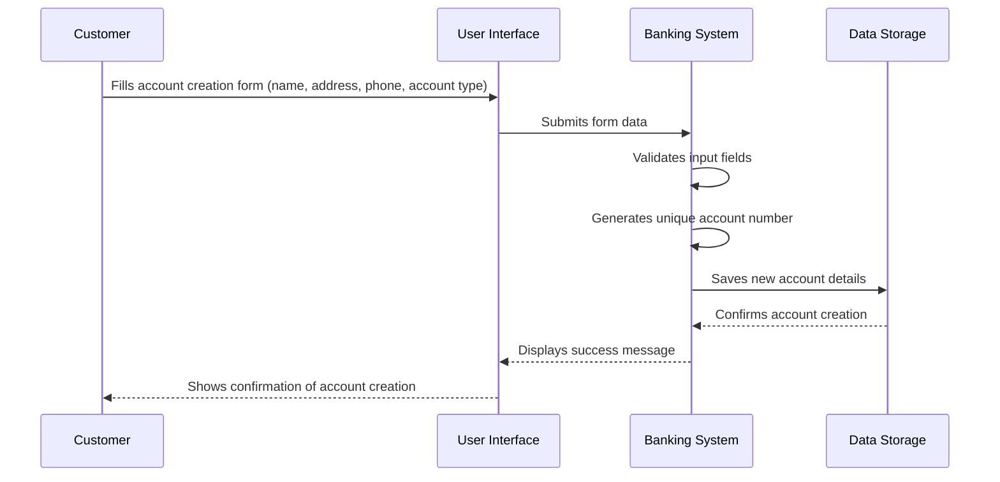

---

#### 2. **Deposit Money**

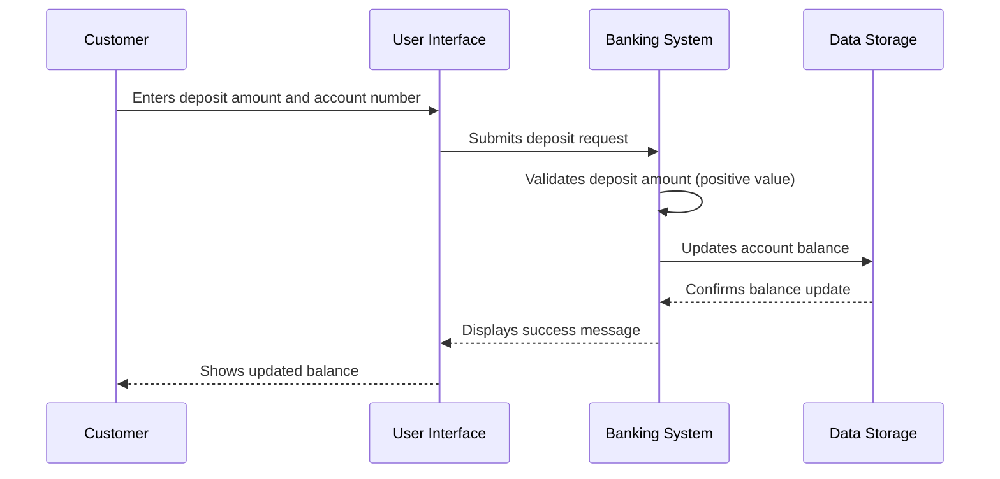

---

#### 3. **Withdraw Money**

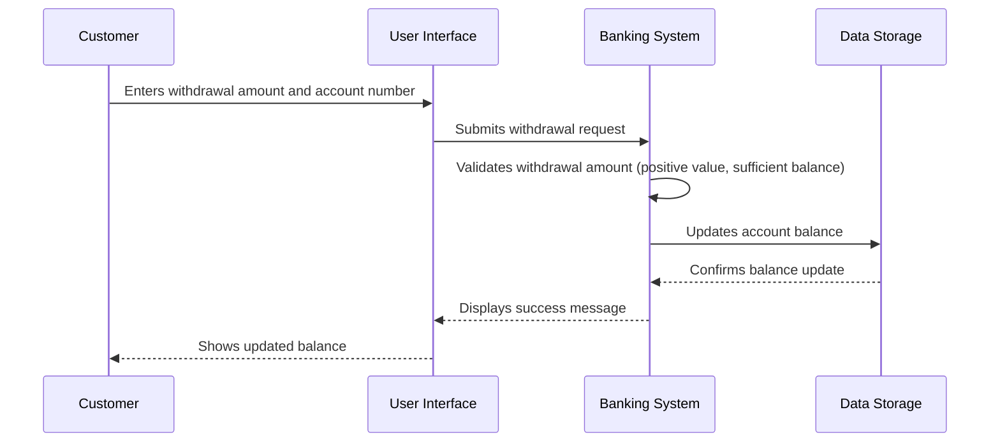

---

#### 4. **Transfer Funds**

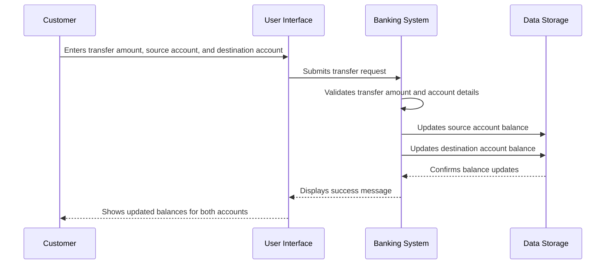

---

#### 5. **View Transaction History**

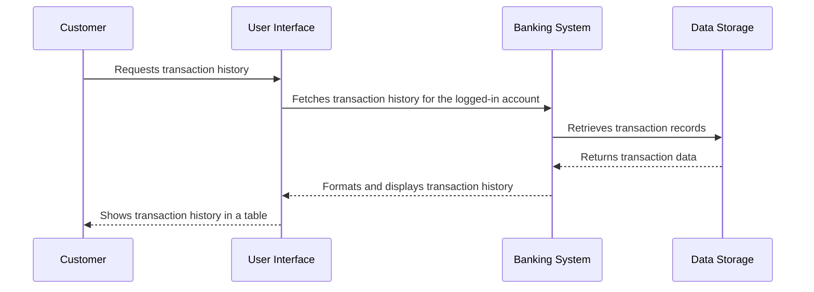

---

#### 6. **Login**

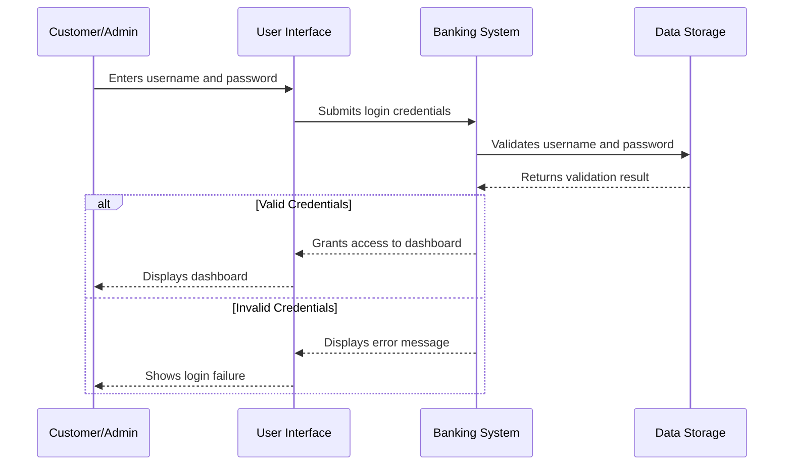

---

#### 7. **Freeze Account (Admin)**

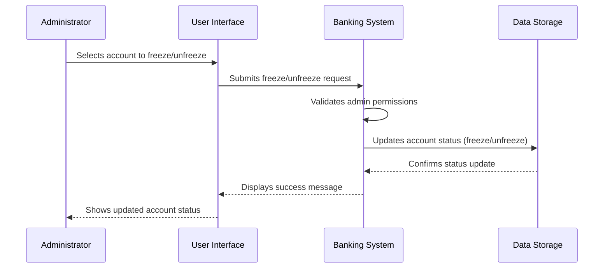

---

#### 8. **Generate Reports (Admin)**

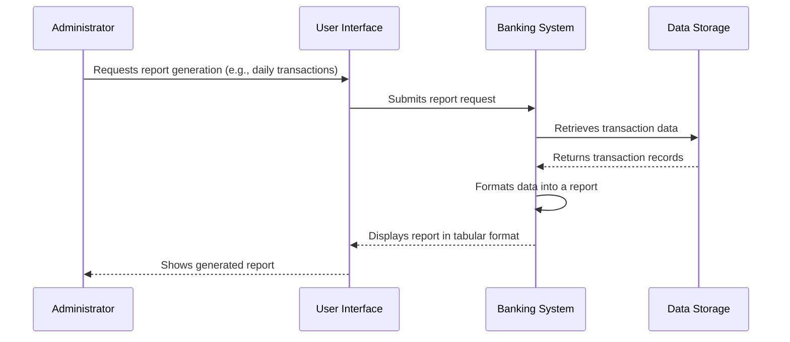

---

#### 9. **Change Password**

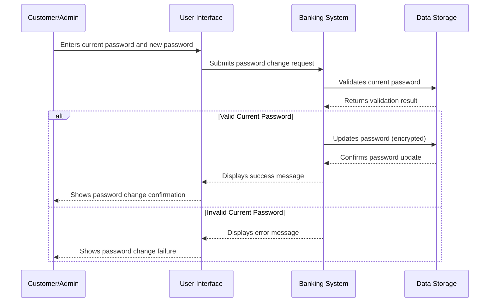

---

These sequence diagrams provide a clear visual representation of the interactions between the user, system, and data storage for each use case. You can use these diagrams to better understand the flow of operations and implement them in your C++ project.

Below are the **use case diagrams** in **Mermaid format** for the Banking System. These diagrams illustrate the relationships between **actors** (Customer and Administrator) and the **use cases** they can perform.

---

#### 1. **Use Case Diagram for Customer**

```mermaid
useCaseDiagram
    actor Customer
    Customer : (Create Account)
    Customer : (Deposit Money)
    Customer : (Withdraw Money)
    Customer : (Transfer Funds)
    Customer : (View Transaction History)
    Customer : (Change Password)
    Customer : (Login)

    Customer --> (Create Account)
    Customer --> (Deposit Money)
    Customer --> (Withdraw Money)
    Customer --> (Transfer Funds)
    Customer --> (View Transaction History)
    Customer --> (Change Password)
    Customer --> (Login)
```

---

#### 2. **Use Case Diagram for Administrator**

```mermaid
useCaseDiagram
    actor Administrator
    Administrator : (View All Accounts)
    Administrator : (Freeze Account)
    Administrator : (Generate Reports)
    Administrator : (Change Password)
    Administrator : (Login)

    Administrator --> (View All Accounts)
    Administrator --> (Freeze Account)
    Administrator --> (Generate Reports)
    Administrator --> (Change Password)
    Administrator --> (Login)
```

---

#### 3. **Combined Use Case Diagram for Customer and Administrator**

```mermaid
useCaseDiagram
    actor Customer
    actor Administrator

    Customer : (Create Account)
    Customer : (Deposit Money)
    Customer : (Withdraw Money)
    Customer : (Transfer Funds)
    Customer : (View Transaction History)
    Customer : (Change Password)
    Customer : (Login)

    Administrator : (View All Accounts)
    Administrator : (Freeze Account)
    Administrator : (Generate Reports)
    Administrator : (Change Password)
    Administrator : (Login)

    Customer --> (Create Account)
    Customer --> (Deposit Money)
    Customer --> (Withdraw Money)
    Customer --> (Transfer Funds)
    Customer --> (View Transaction History)
    Customer --> (Change Password)
    Customer --> (Login)

    Administrator --> (View All Accounts)
    Administrator --> (Freeze Account)
    Administrator --> (Generate Reports)
    Administrator --> (Change Password)
    Administrator --> (Login)
```

---

#### 4. **Use Case Diagram with Relationships**

This diagram shows relationships between use cases, such as **extend** and **include** relationships.

```mermaid
useCaseDiagram
    actor Customer
    actor Administrator

    Customer : (Create Account)
    Customer : (Deposit Money)
    Customer : (Withdraw Money)
    Customer : (Transfer Funds)
    Customer : (View Transaction History)
    Customer : (Change Password)
    Customer : (Login)

    Administrator : (View All Accounts)
    Administrator : (Freeze Account)
    Administrator : (Generate Reports)
    Administrator : (Change Password)
    Administrator : (Login)

    Customer --> (Create Account)
    Customer --> (Deposit Money)
    Customer --> (Withdraw Money)
    Customer --> (Transfer Funds)
    Customer --> (View Transaction History)
    Customer --> (Change Password)
    Customer --> (Login)

    Administrator --> (View All Accounts)
    Administrator --> (Freeze Account)
    Administrator --> (Generate Reports)
    Administrator --> (Change Password)
    Administrator --> (Login)

    (Login) <.. (Change Password) : <<extend>>
    (Deposit Money) <.. (View Transaction History) : <<include>>
    (Withdraw Money) <.. (View Transaction History) : <<include>>
    (Transfer Funds) <.. (View Transaction History) : <<include>>
```

---

#### Explanation of Relationships:

1. **<< extend >>**:
   - The **Change Password** use case extends the **Login** use case because changing a password is an optional action that can only occur after logging in.

2. **<< include >>**:
   - The **View Transaction History** use case includes **Deposit Money**, **Withdraw Money**, and **Transfer Funds** because these transactions are recorded and displayed in the transaction history.

---

These use case diagrams provide a clear visual representation of the interactions between actors (Customer and Administrator) and the use cases they can perform. You can use these diagrams to better understand the system's functionality and implement it in your C++ project.

Below is the **Entity-Relationship Diagram (ERD)** for the Banking System, along with an explanation of the entities, attributes, and relationships. The ERD is represented in **Mermaid format** for easy visualization.

---

### Entity-Relationship Diagram (ERD) in Mermaid Format

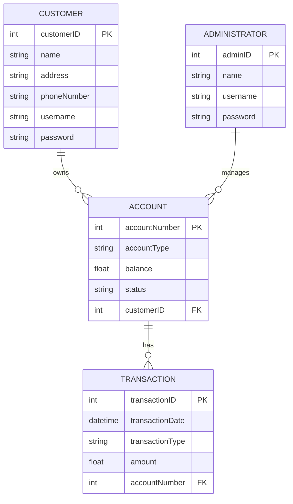

---

### Explanation of the ERD

#### 1. **Entities**

Entities represent the key objects or concepts in the system. In this Banking System, the main entities are:

##### a. **CUSTOMER**

- Represents a bank customer.
- **Attributes**:
  - `customerID` (Primary Key): Unique identifier for each customer.
  - `name`: Full name of the customer.
  - `address`: Address of the customer.
  - `phoneNumber`: Contact number of the customer.
  - `username`: Username for logging into the system.
  - `password`: Encrypted password for authentication.

##### b. **ACCOUNT**

- Represents a bank account owned by a customer.
- **Attributes**:
  - `accountNumber` (Primary Key): Unique identifier for each account.
  - `accountType`: Type of account (e.g., Savings, Current).
  - `balance`: Current balance in the account.
  - `status`: Status of the account (e.g., Active, Frozen).
  - `customerID` (Foreign Key): Links the account to a specific customer.

##### c. **TRANSACTION**

- Represents a financial transaction performed on an account.
- **Attributes**:
  - `transactionID` (Primary Key): Unique identifier for each transaction.
  - `transactionDate`: Date and time of the transaction.
  - `transactionType`: Type of transaction (e.g., Deposit, Withdrawal, Transfer).
  - `amount`: Amount involved in the transaction.
  - `accountNumber` (Foreign Key): Links the transaction to a specific account.

##### d. **ADMINISTRATOR**

- Represents a bank employee who manages customer accounts.
- **Attributes**:
  - `adminID` (Primary Key): Unique identifier for each administrator.
  - `name`: Full name of the administrator.
  - `username`: Username for logging into the system.
  - `password`: Encrypted password for authentication.

---

#### 2. **Relationships**

Relationships define how entities interact with each other.

##### a. **CUSTOMER owns ACCOUNT**

- A **CUSTOMER** can own one or more **ACCOUNTs**.
- This is a **one-to-many** relationship.
- Represented as `CUSTOMER ||--o{ ACCOUNT`.

##### b. **ACCOUNT has TRANSACTION**

- An **ACCOUNT** can have one or more **TRANSACTIONs**.
- This is a **one-to-many** relationship.
- Represented as `ACCOUNT ||--o{ TRANSACTION`.

##### c. **ADMINISTRATOR manages ACCOUNT**

- An **ADMINISTRATOR** can manage one or more **ACCOUNTs**.
- This is a **one-to-many** relationship.
- Represented as `ADMINISTRATOR ||--o{ ACCOUNT`.

---

#### 3. **Attributes**

- **Primary Key (PK)**: A unique identifier for each entity (e.g., `customerID`, `accountNumber`).
- **Foreign Key (FK)**: A field that links one entity to another (e.g., `customerID` in **ACCOUNT** links to **CUSTOMER**).
- **Other Attributes**: Descriptive properties of the entities (e.g., `name`, `balance`, `transactionType`).

---

#### 4. **Key Points**

- **CUSTOMER** and **ADMINISTRATOR** are separate entities because they have different roles and attributes.
- **ACCOUNT** is central to the system, linking **CUSTOMER** and **TRANSACTION**.
- **TRANSACTION** records all financial activities, ensuring traceability and accountability.

---

### Example Data

#### CUSTOMER Table

| customerID | name          | address           | phoneNumber   | username | password (encrypted) |
|------------|---------------|-------------------|---------------|----------|----------------------|
| 1          | John Doe      | 123 Main St       | 555-1234      | johndoe  | ********             |
| 2          | Jane Smith    | 456 Elm St        | 555-5678      | janesmith| ********             |

#### ACCOUNT Table

| accountNumber | accountType | balance | status  | customerID |
|---------------|-------------|---------|---------|------------|
| 1001          | Savings     | 5000.00 | Active  | 1          |
| 1002          | Current     | 2500.00 | Frozen  | 2          |

#### TRANSACTION Table

| transactionID | transactionDate       | transactionType | amount | accountNumber |
|---------------|-----------------------|-----------------|--------|---------------|
| 1             | 2023-10-01 10:00:00   | Deposit         | 1000.00| 1001          |
| 2             | 2023-10-02 11:30:00   | Withdrawal      | 500.00 | 1001          |

#### ADMINISTRATOR Table

| adminID | name          | username | password (encrypted) |
|---------|---------------|----------|----------------------|
| 1       | Admin User    | admin    | ********             |

---

### Summary

The ERD provides a clear and structured representation of the Banking System's data model. It defines the entities, their attributes, and the relationships between them. This diagram serves as a blueprint for designing the database schema and implementing the system in C++.

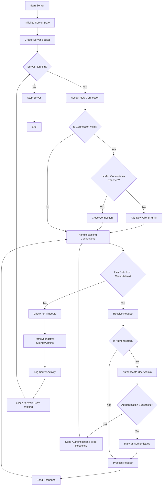